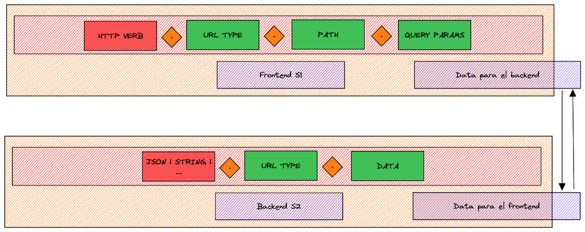

# Integrated Services Project

This project consists of three main services that work together to provide a complete solution. The following details each of the services and how they interact with each other.

## Table of Contents

- Service 1: TCP Socket Client] (#service-1-socket-tcp-client)
- Service 2: TCP Socket Server](#service-2-socket-tcp-server)
- Service 3: Django HTTP Server](#service-3-socket-http-django-server)
- Data Flow](#data-flow)
- Installation and Configuration](#installation-and-configuration)

## Service 1: TCP Socket Client

The first service is a TCP socket client that is responsible for sending messages with a specific text format to Service 2 (TCP socket server). This message can contain information related to the request for all products or a specific product.

## Service 2: TCP Socket Server

The second service is a TCP socket server that receives messages sent by Service 1 (TCP socket client). Based on the message received, the TCP socket server makes requests to the REST endpoints of Service 3 (Django HTTP server) to get all products in the Django database or a specific product.

## Service 3: Django HTTP server

The third service is an HTTP server developed with Django, which has a connection to RabbitMQ and uses Celery and Celery Beat to orchestrate tasks periodically. This server exposes the REST endpoints necessary for Service 2 to obtain product information.

## Data Flow

1. Service 1 sends a message to Service 2 with a request for products.
2. Service 2, based on the message received, makes requests to Service 3's REST endpoints.
3. Service 3 responds with the requested product information.
4. If Service 2 requested a single product, it will do so periodically and send the updated information to Service 1.
5. Service 1 reviews the product updates and decides whether or not to stop the socket flow.

## Installation and Configuration

*Describe here the steps to install and configure each of the services, including prerequisites, dependencies and specific configurations.

## IEB Solution for de problem:

# Socket Client/Server dependencies

# Project Folder structure

# Layer Communication

# Data formats between sockets

---
