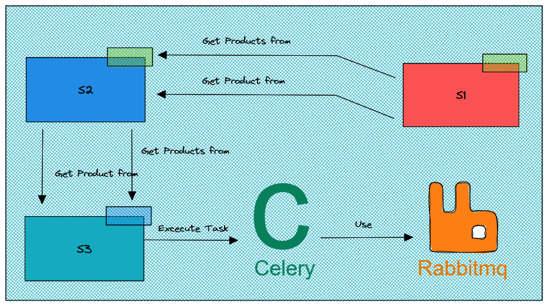
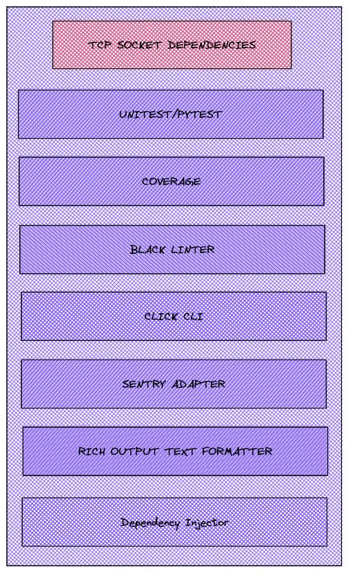
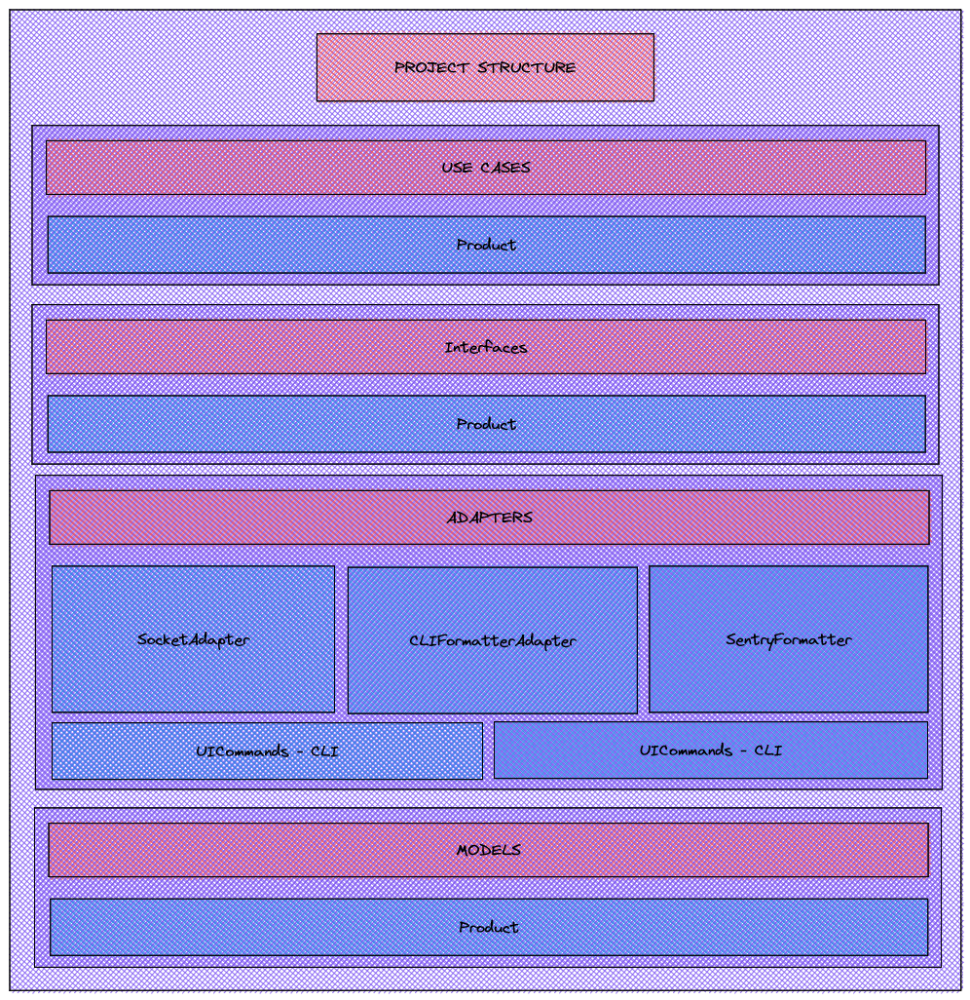
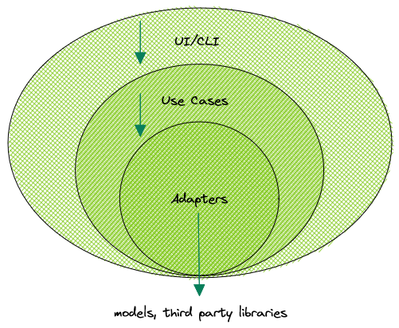
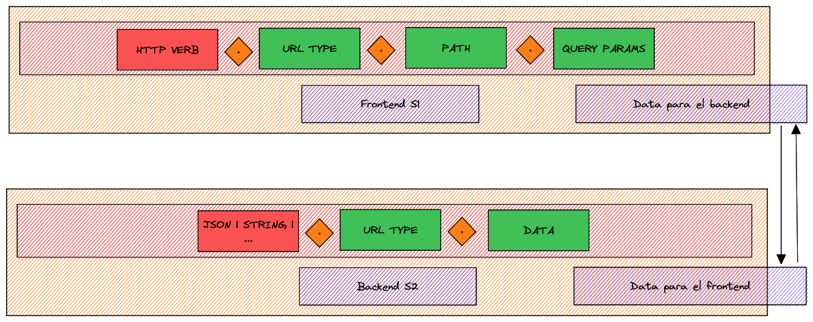

# Proyecto de Servicios Integrados

Este proyecto consta de tres servicios principales que trabajan en conjunto para proporcionar una solución completa. A continuación, se detalla cada uno de los servicios y cómo interactúan entre sí.

## Tabla de Contenidos

- [Servicio 1: Socket TCP Cliente](#servicio-1-socket-tcp-cliente)
- [Servicio 2: Socket TCP Servidor](#servicio-2-socket-tcp-servidor)
- [Servicio 3: Servidor HTTP Django](#servicio-3-servidor-http-django)
- [Flujo de Datos](#flujo-de-datos)
- [Instalación y Configuración](#instalación-y-configuración)

## Servicio 1: Socket TCP Cliente

El primer servicio es un cliente de socket TCP que se encarga de enviar mensajes con un formato específico de texto al Servicio 2 (servidor de socket TCP). Este mensaje puede contener información relacionada con la solicitud de todos los productos o un producto en específico.

## Servicio 2: Socket TCP Servidor

El segundo servicio es un servidor de socket TCP que recibe los mensajes enviados por el Servicio 1 (cliente de socket TCP). En función del mensaje recibido, el servidor de socket TCP realiza solicitudes a los endpoints REST del Servicio 3 (servidor HTTP Django) para obtener todos los productos de la base de datos de Django o un producto específico.

## Servicio 3: Servidor HTTP Django

El tercer servicio es un servidor HTTP desarrollado con Django, que cuenta con una conexión a RabbitMQ y utiliza Celery y Celery Beat para orquestar tareas periódicamente. Este servidor expone los endpoints REST necesarios para que el Servicio 2 pueda obtener la información de los productos.

## Flujo de Datos

1. El Servicio 1 envía un mensaje al Servicio 2 con una solicitud de productos.
2. El Servicio 2, en función del mensaje recibido, realiza solicitudes a los endpoints REST del Servicio 3.
3. El Servicio 3 responde con la información solicitada de los productos.
4. Si el Servicio 2 solicitó un solo producto, lo hará periódicamente y enviará la información actualizada al Servicio 1.
5. El Servicio 1 revisa las actualizaciones del producto y decide si detener o no el flujo de socket.

## Instalación y Configuración

*Describa aquí los pasos para instalar y configurar cada uno de los servicios, incluidos los requisitos previos, las dependencias y las configuraciones específicas.*

# IEB Solution for de problem:

# Socket Client/Server dependencies

# Project Folder structure

# Layer Communication

# Data formats between sockets

---
